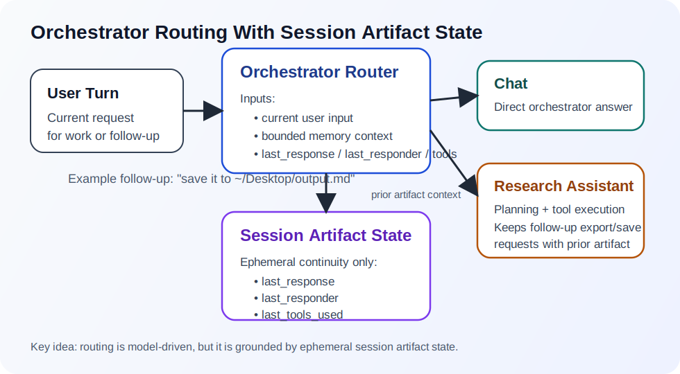
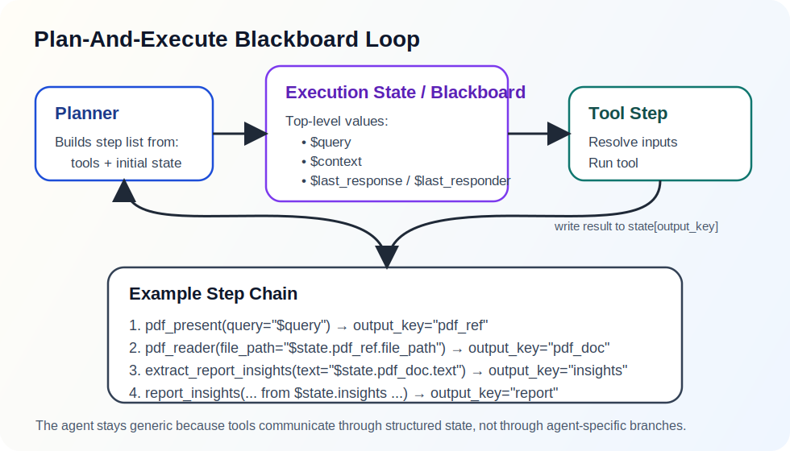

# Orchestration Routing

This document describes the orchestration and routing pattern used by OmniDex.

## Pattern

OmniDex uses a hybrid of:

- orchestrator pattern
- plan-and-execute agent pattern
- policy-validated agentic routing and handoffs
- deterministic fast paths for explicit direct workflows
- blackboard-style shared state
- ephemeral session artifact state
- bounded artifact history

The orchestrator decides which handler should receive the current turn.
Specialized agents then either:

- execute a deterministic direct flow for explicit tasks
- or generate a tool plan and execute it against a shared step state

Follow-up requests like `save it` rely on short-lived session artifact state
rather than only on long-term memory search.

## Why This Exists

Pure semantic routing on the current user utterance is not enough for follow-up
actions.

Example:

1. User asks for insights on a PDF.
2. `research_assistant` generates a markdown artifact.
3. User then says: `I want to save it in ~/Desktop/output.md`.

The second message is ambiguous in isolation. The orchestrator needs awareness
of the previous artifact, who produced it, and whether the new request is a
continuation of that artifact.

## Layers

### 1. Orchestrator Routing

The orchestrator routes across registered handlers:

- `chat_agent`
- `research_assistant`

Routing is now two-stage and agentic:

1. the orchestrator asks the local model to choose the best initial handler
2. a shared policy validator accepts or overrides the proposed route only for
   hard constraints
3. the selected agent may request a handoff before execution
4. the shared policy validator accepts or rejects the proposed handoff only for
   hard constraints

The router prompt is built from the registered handlers at runtime. It also
receives:

- bounded conversational memory
- ephemeral session artifact state

Session artifact state includes:

- `last_response`
- `last_artifact_content`
- `last_artifact_responder`
- `last_responder`
- `last_tools_used`
- `artifact_history`

This lets the router keep a follow-up `save it` request with the same handler
that owns the active artifact, even if the previous conversational turn was
answered by a different agent.

This allows the system to recover when the initial route is imperfect. For
example, if `research_assistant` receives a turn that is really just a generic
question about the current artifact, it can request a handoff to `chat_agent`.

The current design is a policy model with validation:

- the model proposes the initial route
- the model can propose agent-to-agent handoffs
- a shared validator only enforces hard constraints such as:
  - explicit PDF workflows staying with `research_assistant`
  - explicit save/export follow-ups staying with `research_assistant` when it
    can complete them

For referential persistence requests such as:

- `save this`
- `save it`
- `write that`
- `export it`

the router is expected to use session artifact state as evidence that the
current request is a continuation of the prior artifact.



### 2. Agent Decision Layer

The selected agent can first make a structured handoff decision.

This is model-driven rather than hard-coded. The agent returns one of:

- answer directly
- hand off to another registered agent with a reason and confidence

The orchestrator then validates the proposal against shared hard constraints.
If valid, the handoff is accepted. If not, the current agent keeps the turn.

The orchestrator also allows only a bounded handoff chain so the turn cannot
bounce forever.

After the handoff check, `research_assistant` uses a hybrid strategy.

It first checks for deterministic direct flows:

- explicit PDF summary requests
- explicit PDF insight requests
- explicit follow-up save or export requests with an existing artifact

If none of those apply, it falls back to model-planned tool execution.

`chat_agent` is the default conversational responder. It can answer broad
general-topic questions with no tools, and it can also answer questions about
the active artifact when the shared session state is enough.

### 3. Agent Planning

When direct handling does not apply, `research_assistant`:

1. builds a dynamic tool catalog from registered tool objects
2. gives the model an execution-state vocabulary
3. asks the model to return a structured plan

The plan generator is shared engine infrastructure so additional agents can
reuse the same planning mechanism with different tool catalogs.

Plan steps contain:

- `tool_name`
- `inputs`
- `output_key`
- `reason`

The planner can reference:

- `$query`
- `$context`
- `$last_response`
- `$last_artifact_content`
- `$last_artifact_responder`
- `$last_responder`
- `$state.some_step.some_field`

That is what enables planned follow-up save behavior even when the direct path
does not fire.

For ordinary non-save turns, `research_assistant` now hides write-intent tools
from the planner. `determine_output_write` and `extract_output_request` are only
exposed when the current query contains an explicit output request. This reduces
false write/save plans on generic concept questions.

Planned save/export flows now also require internally valid state references.
If a plan includes something like `$state.write_request.write_output`, an
earlier step must actually produce `write_request`. Otherwise the planner
rejects that plan and triggers a repair pass before execution.

### 4. Generic Tool Execution

The executor loops through plan steps generically.

For each step it:

1. resolves input references
2. validates required inputs
3. runs the tool
4. stores the normalized result at `state[output_key]`

Tools return structured dictionaries, typically with:

- `status`
- `content`
- task-specific fields like `text`, `summary`, `filename`, `keywords`,
  `artifact_content`

This is a blackboard-style model because each tool reads from and writes to
shared execution state rather than calling downstream tools directly.



## Session Artifact State Vs Memory

These are different concerns.

### Long-term / search memory

Used for:

- user preferences
- durable facts
- semantically relevant old context

Not ideal for:

- exact previous markdown output
- exact previous responder
- immediate follow-up export requests

### Ephemeral session artifact state

Used for:

- exact last response body
- exact last artifact body
- which agent owns the current artifact
- which agent produced the previous turn
- which tools were used
- a bounded history of prior artifacts in this session

This is the correct place for `save it`, `export that`, and `write the previous
result to a file`.

## Current Flow

### PDF insight request

Example:

```text
give me insights on /home/user/Desktop/paper.pdf
```

Current preferred path:

1. `pdf_present`
2. `pdf_reader`
3. `extract_report_insights`
4. `report_insights`
5. `create_output`

For this case the system now usually takes a deterministic direct flow rather
than paying for an extra planner call.

### PDF summary request

Example:

```text
summarize /home/user/Desktop/paper.pdf
```

Current preferred path:

1. `pdf_present`
2. `pdf_reader`
3. `summarize_text`
4. `create_output`

### Follow-up save request

Example:

```text
I want to save it in ~/Desktop/output.md
```

Current preferred path:

1. read `last_artifact_content`
2. `extract_output_request`
3. `create_output`

For this case the system now usually takes a deterministic direct follow-up save
path. The planner still supports it, but it is no longer required for the common
case.

When the planner is used for a save/export turn, incomplete plans are no longer
allowed to fall through to execution. This avoids the failure mode where
`create_output` renders the artifact but does not write the file because a
referenced write-intent step was never produced.

The filename extraction layer now supports common phrasings such as:

- `save it to /path/file.md`
- `save it to file /path/file.md`
- `save this as /path/file.md`
- `write that into /path/file.md`
- `output file: /path/file.md`

There is also a generic path fallback for `~/...`, `./...`, `../...`, and
absolute paths.

## Design Rules

- Keep initial routing and handoffs model-proposed.
- Keep validation narrow and explicit.
- Let `chat_agent` own ordinary chat and artifact discussion.
- Let `research_assistant` own explicit research workflows and artifact
  persistence.
- Preserve session artifact state across delegation boundaries.
- Keep obvious high-confidence flows deterministic when planning would add only
  latency.
- Keep tool planning model-driven over registered tools.
- Keep tool execution generic and state-based.
- Store short-lived artifact continuity separately from durable memory.
- Prefer structured tool outputs over plain strings.

## Tradeoffs

Benefits:

- follow-up actions are much more reliable
- common PDF workflows are faster
- tool pipelines are easier to extend
- new agents can reuse the same planning/execution model

Costs:

- planner quality still depends on the model
- some flow decisions now live in deterministic code as well as prompts
- tool contracts must stay structured and consistent
- state-reference debugging becomes important

## Related Documents

- [Tool Routing](./tool_routing.md)
- [State Artifacts](./state_artifacts.md)
- [Inference](./inference.md)

## Files

- [`omnidex/engine/planner.py`](../../omnidex/engine/planner.py)
- [`omnidex/engine/planner_prompts.py`](../../omnidex/engine/planner_prompts.py)
- [`omnidex/agents/chat_agent/agent.py`](../../omnidex/agents/chat_agent/agent.py)
- [`omnidex/agents/orchestrator/agent.py`](../../omnidex/agents/orchestrator/agent.py)
- [`omnidex/agents/research_assistant/agent.py`](../../omnidex/agents/research_assistant/agent.py)
- [`omnidex/agents/research_assistant/prompts.py`](../../omnidex/agents/research_assistant/prompts.py)
- [`omnidex/utils/plan_execution.py`](../../omnidex/utils/plan_execution.py)
- [`omnidex/utils/planning.py`](../../omnidex/utils/planning.py)
- [`omnidex/utils/introspection.py`](../../omnidex/utils/introspection.py)
- [`omnidex/tools`](../../omnidex/tools)
