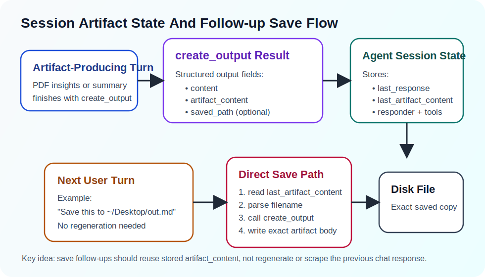

# State Artifacts

This document describes the short-lived artifact state used for multi-turn
continuity in OmniDex.



## Why This Exists

Conversation memory is not enough for requests like:

- `save this to ~/Desktop/output.md`
- `export it`
- `write that result to a file`

Those requests are not asking the system to regenerate content. They are asking
it to persist a specific artifact that was already produced in a previous turn.

That requires exact session continuity rather than semantic memory retrieval.

## Two Kinds Of State

OmniDex keeps two different kinds of continuity:

- memory context: useful for durable facts, preferences, and semantically
  relevant prior conversation
- session artifact state: useful for exact previous outputs and immediate
  follow-up actions

The artifact layer is intentionally ephemeral. It represents the current
session's latest generated artifact, not a durable knowledge store.

## Artifact Fields

The current session artifact contract includes:

- `last_response`: the full user-facing response from the previous turn
- `last_artifact_content`: the clean artifact body that should be reused for
  follow-up persistence or transformation
- `last_responder`: which agent produced the previous turn
- `last_tools_used`: the tools used by that agent on the previous turn

## Why `last_artifact_content` Was Added

`last_response` is not a stable artifact boundary.

Examples:

- a save response may append `[Saved output to ...]`
- a future response may include explanatory text around the artifact
- a planner fallback might return a tool message rather than a clean document

`last_artifact_content` solves that by storing the exact rendered artifact body
separately from the full response.

That makes follow-up save behavior deterministic at the session level:

1. a tool pipeline produces an artifact
2. the artifact body is stored in `last_artifact_content`
3. a later `save this to ...` request writes that exact artifact body

The artifact is still model-derived when it is first created, but once it exists
in session state, follow-up persistence does not regenerate it.

## Where Artifact State Is Produced

### `create_output`

`create_output` is the canonical output-finalization tool.

It returns:

- `content`: the user-facing response
- `artifact_content`: the clean artifact body
- `saved_path`: optional path when written to disk

`artifact_content` is the stable value that should be carried forward across
turns.

The effective `create_output` result shape is:

```python
{
    "status": "ok",
    "content": "Rendered response shown to the user.",
    "artifact_content": "Rendered artifact body without save-status suffixes.",
    "saved_path": "/abs/path/output.md" | None,
}
```

The important separation is:

- `content`: current-turn response text
- `artifact_content`: reusable artifact payload

## Where Artifact State Is Stored

### In `research_assistant`

`research_assistant` updates its own `session_state` after:

- direct PDF summary flows
- direct PDF insight flows
- direct follow-up save flows
- generic planned execution when a final tool result exists

The agent prefers `artifact_content` when available and falls back to the final
output only when needed.

Its session-state shape is effectively:

```python
{
    "last_response": "...",
    "last_artifact_content": "...",
    "last_responder": "research_assistant",
    "last_tools_used": ["tool_a", "tool_b"],
}
```

### In `orchestrator`

The orchestrator copies its session state into delegated agents before a run,
then reads back the delegated agent's session state after the run completes.

That ensures `last_artifact_content` survives delegation boundaries and is
available on the next turn for routing and follow-up save behavior.

The orchestrator carries the same fields at the session boundary so delegated
agents receive and return a compatible artifact-state structure.

## Follow-up Save Flow

For a request such as:

```text
Save this to /home/user/Desktop/output.md
```

the system prefers a deterministic direct path:

1. read `last_artifact_content` from session state
2. parse filename and write intent from the current query
3. call `create_output(content=last_artifact_content, ...)`
4. write the exact stored artifact body to disk

This avoids depending on the planner for a simple persistence action.

## Router Visibility

The orchestrator includes a bounded excerpt of:

- `last_response`
- `last_artifact_content`
- `last_responder`
- `last_tools_used`

in routing context. That gives the router evidence that a short follow-up like
`save it` is a continuation of the previously produced artifact.

## Design Rules

- Treat artifact continuity separately from semantic memory.
- Prefer `last_artifact_content` over `last_response` for persistence actions.
- Preserve artifact state across agent delegation.
- Keep artifact state exact and rendered, not abstract.
- Do not regenerate prior artifacts when the user only asked to save them.

## Relevant Files

- [`omnidex/tools/create_output.py`](../../omnidex/tools/create_output.py)
- [`omnidex/agents/research_assistant/agent.py`](../../omnidex/agents/research_assistant/agent.py)
- [`omnidex/agents/orchestrator/agent.py`](../../omnidex/agents/orchestrator/agent.py)
