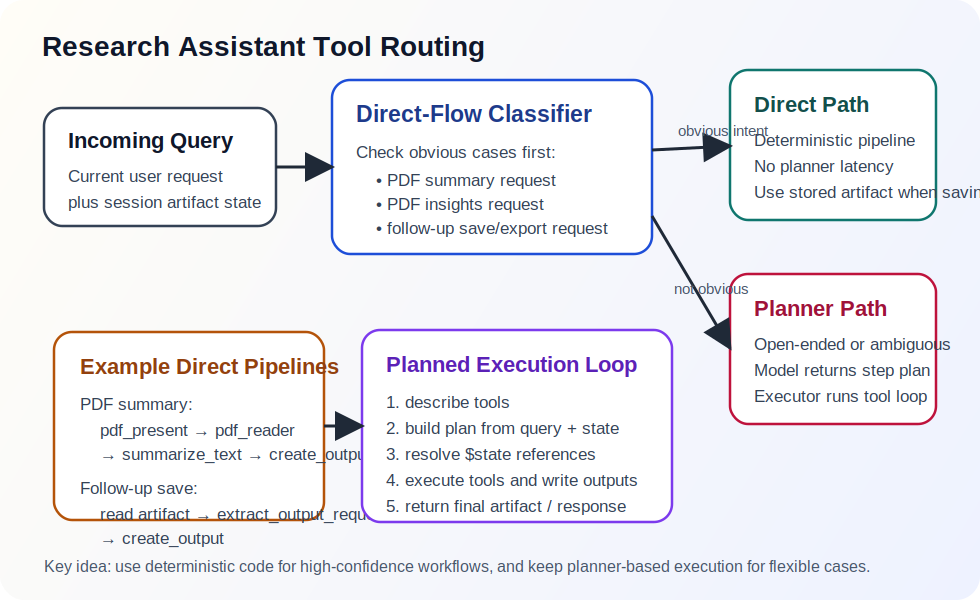

# Tool Routing

This document describes how `research_assistant` decides whether to:

- use a deterministic direct flow
- ask the model to generate a structured tool plan



## The Core Strategy

OmniDex does not use a single routing style inside `research_assistant`.

Instead it uses a hybrid:

- deterministic direct flows for obvious high-confidence cases
- model-planned tool execution for open-ended or ambiguous cases

This keeps simple PDF operations fast while preserving extensibility for more
general research tasks.

## Structural Contracts

The routing and planning layer is driven by lightweight structural contracts
rather than a separate JSON Schema system.

The planning implementation itself is now shared engine infrastructure rather
than a `research_assistant`-local command.

In practice, the tool schema is inferred from:

- the tool object's `name`
- the tool object's `output_fields`
- the Python signature of `run(...)`
- the tool class or method docstring

That inferred metadata is what the planner sees.

### Base Tool Contract

All tools inherit from `BaseTool` and are expected to provide:

```python
class BaseTool(ABC):
    name = "base_tool"
    output_fields: tuple[str, ...] = ("content",)

    @abstractmethod
    def run(self, *args, **kwargs):
        ...
```

This is the minimum contract that makes a tool visible to the planning and
execution layers.

### Inferred Tool Description Schema

`describe_tools(...)` converts live tool objects into a planner-facing catalog
with this shape:

```python
{
    "name": "tool_name",
    "description": "Normalized docstring text.",
    "inputs": ["param_a", "param_b"],
    "outputs": ["content", "other_field"]
}
```

Important details:

- `inputs` comes from `inspect.signature(tool.run)`
- required vs optional inputs are not encoded in the catalog itself
- `outputs` comes from `tool.output_fields`
- if a tool does not declare `output_fields`, it defaults to `["content"]`

So the planner is not reading a hand-authored schema file. It is reading
introspected metadata from live tool classes.

The shared planner lives under:

- [`omnidex/engine/planner.py`](../../omnidex/engine/planner.py)
- [`omnidex/engine/planner_prompts.py`](../../omnidex/engine/planner_prompts.py)

## Direct Flows

Direct flows are used when the user intent is obvious enough that planning would
only add latency.

### Direct PDF Summary / Insight Flow

If the query clearly references a PDF and contains strong summary or insight
language, the agent bypasses the planner.

Examples:

- `summarize /home/user/Desktop/paper.pdf`
- `give me insights on /home/user/Desktop/paper.pdf`

The direct PDF flow does this:

1. `pdf_present`
2. `pdf_reader`
3. one of:
   - `summarize_text`
   - `extract_report_insights` -> `report_insights`
4. `create_output`

Why this is direct:

- the tool sequence is deterministic
- no planning value is gained
- planner latency is avoided

### Direct Follow-up Save Flow

If the user explicitly asks to save, write, or export a previous artifact and a
filename is present, the agent bypasses the planner again.

Examples:

- `save this to ~/Desktop/out.md`
- `export it as ./result.md`

The direct save flow does this:

1. read `last_artifact_content`
2. `extract_output_request`
3. `create_output`

Why this is direct:

- this is a persistence action, not a content-generation task
- the artifact already exists in session state
- the planner previously failed intermittently by stopping too early

## Planned Tool Execution

When a request is not an obvious direct case, `research_assistant` falls back to
model-planned execution.

The planner:

1. receives a tool catalog built from live tool objects
2. receives initial state such as `$query`, `$context`, and prior session state
3. returns a JSON plan with `tool_name`, `inputs`, `output_key`, and `reason`

The same planner class is intended to be reusable by future agents with
different tool catalogs and prompt policy.

The executor then:

1. resolves references such as `$state.foo.bar`
2. validates required inputs
3. runs each tool
4. stores normalized results back into execution state

This is a blackboard-style plan-and-execute loop.

### Planner Output Schema

The planner is expected to return JSON in this normalized shape:

```json
{
  "plan": [
    {
      "step": 1,
      "tool_name": "tool_name_here",
      "inputs": {
        "param": "value"
      },
      "output_key": "state_key_here",
      "reason": "why this step is needed"
    }
  ]
}
```

Each accepted step is normalized into the internal `ToolPlanStep` structure:

```python
@dataclass(slots=True)
class ToolPlanStep:
    step: int
    tool_name: str
    inputs: dict[str, object]
    output_key: str
    reason: str
```

### Execution State Schema

Planned execution uses a shared mutable state dictionary. Its top-level shape is:

```python
state = {
    "query": query,
    "context": context,
    # optional initial state injected by the agent
    "last_response": "...",
    "last_artifact_content": "...",
    "last_responder": "...",
    "last_tools_used": [...],
    # step outputs are written here by output_key
    "some_output_key": {...},
}
```

Planner references are resolved using two forms:

- `$name` for top-level state values such as `$query`
- `$state.foo.bar` for nested tool outputs such as `$state.pdf_doc.text`

### Normalized Tool Result Schema

The executor normalizes every tool result into a dictionary before storing it in
state.

If a tool already returns a dictionary, the executor:

- preserves the existing fields
- injects `status="ok"` when missing
- injects `content` from one of `answer`, `summary`, `text`, or `value` when
  possible

If a tool returns a plain scalar, it becomes:

```python
{
    "status": "ok",
    "value": raw_result,
    "content": str(raw_result),
}
```

This makes the execution state structurally consistent even when tools return
different shapes.

### Output Field Convention

`output_fields` is not enforced at runtime as a strict validator. It is a
declared output contract used for:

- planner-facing tool descriptions
- human-readable documentation
- keeping tool outputs predictable across agents

The effective convention is:

- every tool should expose a meaningful `content` field directly or indirectly
- task-specific fields should be declared in `output_fields`
- downstream tools should read specific fields when precision matters

Examples:

```python
PDFReaderTool.output_fields = ("file_path", "text", "content")
CreateOutputTool.output_fields = ("content", "artifact_content", "saved_path")
ExtractReportInsightsTool.output_fields = (
    "title",
    "keywords",
    "strengths",
    "novel_approach",
    "gaps_and_limitations",
    "content",
)
```

## PDF Tool Pipeline Details

The PDF path is intentionally layered.

### `pdf_reader`

Reads all pages and preprocesses extracted text before downstream use.

Current cleanup includes:

- repeated header and footer removal when the same margin text appears across
  many pages
- standalone page number removal
- whitespace normalization
- paragraph reflow for broken PDF line wraps
- simple de-hyphenation across line breaks

### `summarize_text`

Runs a bounded map/reduce summary flow:

1. choose representative PDF chunks
2. summarize each selected chunk
3. recursively combine partial summaries until they fit the prompt budget

`max_summary_chunks` now bounds the real expensive summary fan-out rather than
only the preselection phase.

### `extract_report_insights`

Uses the same summary-source selection strategy, then asks the model for a
structured insight payload. `report_insights` formats that payload into the
stable markdown artifact.

Its effective structured output shape is:

```python
{
    "status": "ok",
    "title": "...",
    "keywords": ["..."],
    "strengths": ["..."],
    "novel_approach": "...",
    "gaps_and_limitations": ["..."],
    "content": "...",
}
```

## Planner Constraints

The planner prompt includes explicit rules for persistence flows.

Notably:

- save/export requests are not complete unless `create_output` is included
- plans must not stop at `determine_output_write`
- follow-up save plans should reference prior artifact state

These rules exist because save actions are about artifact continuity, not new
generation.

## Output Artifact Schema

`create_output` is the canonical output-finalization tool. Its effective result
shape is:

```python
{
    "status": "ok",
    "content": "User-facing response, possibly including save message.",
    "artifact_content": "Clean rendered artifact body.",
    "saved_path": "/abs/path/output.md" | None,
}
```

This distinction is important:

- `content` is what the user sees in the current turn
- `artifact_content` is what should be stored and reused for later persistence
  or transformation

## Current Decision Table

- explicit PDF summary request: direct flow
- explicit PDF insights request: direct flow
- follow-up save/export with a prior artifact: direct flow
- ambiguous or open-ended research request: planned flow
- generic chat request: handled by the orchestrator chat path, not this agent

## Tradeoffs

Benefits:

- lower latency on common PDF workflows
- more reliable follow-up save behavior
- better separation between generation and persistence
- still extensible through planner-based tools

Costs:

- some routing logic is split between deterministic code and planner prompts
- direct-path heuristics must be kept conservative
- session artifact state becomes part of the tool-routing contract

## Relevant Files

- [`omnidex/engine/planner.py`](../../omnidex/engine/planner.py)
- [`omnidex/engine/planner_prompts.py`](../../omnidex/engine/planner_prompts.py)
- [`omnidex/agents/research_assistant/agent.py`](../../omnidex/agents/research_assistant/agent.py)
- [`omnidex/agents/research_assistant/prompts.py`](../../omnidex/agents/research_assistant/prompts.py)
- [`omnidex/tools/pdf_reader.py`](../../omnidex/tools/pdf_reader.py)
- [`omnidex/tools/summarize_text.py`](../../omnidex/tools/summarize_text.py)
- [`omnidex/tools/extract_report_insights.py`](../../omnidex/tools/extract_report_insights.py)
- [`omnidex/utils/plan_execution.py`](../../omnidex/utils/plan_execution.py)
